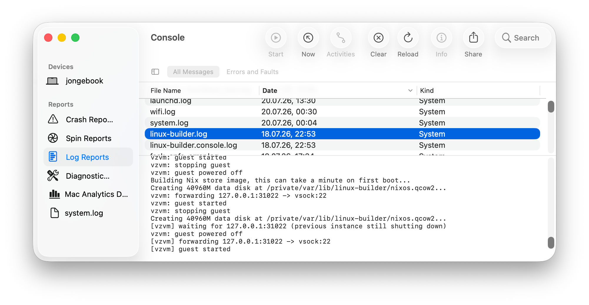

# vzvm

A drop-in replacement for the upstream QEMU-based `darwin.linux-builder`, built on Apple's
Virtualization.framework.

It runs the Nix Linux builder as an aarch64 NixOS guest and — unlike QEMU on macOS — exposes
**Rosetta**, so `x86_64-linux` builds are translated instead of software-emulated. Switching
to it is a one-line change to `nix.linux-builder.package`, and switching back is the same.

## Why use it

Measured against `darwin.linux-builder` on the same machine (Apple M3 Pro), with identical
resources — see [Benchmarks](#benchmarks):

- **`x86_64-linux` builds are 2.54x faster.** QEMU on macOS cannot use Rosetta; it needs a
  `boot.binfmt.emulatedSystems` opt-in and then runs those builds under qemu-user TCG. vzvm
  uses Rosetta instead.
- **Boots ~1.9x faster** — 12.0s to a usable builder versus ~22.7s.
- **~2.6x smaller on disk.** The host closure is ~1.2 GiB versus ~3.2 GiB, and contains no
  QEMU.
- **macOS-native logging.** Diagnostics and the guest console go to unified logging under
  `systems.applicative.vzvm` — see [Logs](#logs).
- **Genuinely drop-in.** Same port, same host key, same `nix.linux-builder` options.
  Validated through repeated `darwin-rebuild switch` cycles against a live machine, not
  only in evaluation.

Native `aarch64-linux` build performance is roughly the same.
The win is Rosetta and the operational fit, not raw hypervisor speed.

## Switch to it now

New to Nix on macOS or the Linux builder? Start with
[Nix on macOS](https://nixcademy.com/posts/nix-on-macos/) and
[the macOS Linux builder](https://nixcademy.com/posts/macos-linux-builder/) for the
background this section assumes.

Requires `aarch64-darwin`, macOS 13+, and Rosetta
(`softwareupdate --install-rosetta --agree-to-license`).

Add the flake input, then apply the overlay and select the backend in a nix-darwin module:

(You will already have most of this. The new lines are highlighted with `# NEW`)

```nix
# flake.nix
{
  inputs = {
    nixpkgs.url = "github:NixOS/nixpkgs/nixpkgs-unstable";
    nix-darwin.url = "github:nix-darwin/nix-darwin";

    vzvm.url = "github:applicative-systems/vzvm"; # NEW
  };

  outputs =
    { nix-darwin, vzvm, ... }:
    {
      darwinConfigurations.myhost = nix-darwin.lib.darwinSystem {
        modules = [
          (
            { pkgs, ... }:
            {
              nixpkgs.hostPlatform = "aarch64-darwin";
              nixpkgs.overlays = [ 
                vzvm.overlays.default # NEW
              ];

              nix.linux-builder = {
                enable = true;
                package = pkgs.darwin.linux-builder-vz; # NEW
                systems = [
                  "aarch64-linux"
                  "x86_64-linux" # NEW: required, or Rosetta goes unused
                ];
              };
            }
          )
          # ... your other modules
        ];
      };
    };
}
```

Without flakes, add the overlay from a path — `nixpkgs.overlays = [ (import /path/to/vzvm/overlay.nix) ];` — and set `nix.linux-builder.package` the same way.

Unless `nix.linux-builder.ephemeral` is set, delete the old QEMU builder's data disk first —
vzvm reuses that filename but writes a raw image and refuses to misread a leftover qcow2:

```
sudo rm -f /var/lib/linux-builder/nixos.qcow2
```

Then `darwin-rebuild switch`. The first build is slow: the old builder compiles the new
`aarch64-linux` guest before activation stops it, and vzvm's own tooling builds from source
while it ships as an overlay — once it lands in nixpkgs (see [Upstreaming](#upstreaming)) that
part comes from the binary cache. Everything else — `ephemeral`, `maxJobs`,
`workingDirectory`, `config`, port 31022, the committed host key — is unchanged, so no
`known_hosts` or `/etc/nix/machines` edits are needed.

**[MIGRATING.md](MIGRATING.md)** has the full walkthrough: why the switch is not circular,
verification commands, rollback (also one line), and troubleshooting.

## Upstreaming

This repository is a staging area. The goal is for nixpkgs and nix-darwin to carry the Nix
side so a vz-backed builder is a supported option, not a third-party overlay:

- **The Swift sources stay here.** `vzvm/` is the upstream source; nixpkgs would package it as
  `pkgs.darwin.vzvm`, fetching a tagged release. (`pkgs.vzvm` is a provisional overlay name.)
- **The modules go as a refactor plus one backend** — the module split (see
  [How the Nix side is organised](#how-the-nix-side-is-organised)) is already shaped for that
  review.
- **A switch, not a replacement.** QEMU stays the default; the backend and the
  `aarch64-darwin`-only host requirement become things you opt into, ideally via a declarative
  `nix.linux-builder` option rather than a package substitution.

Until then it is usable as an overlay, and [MIGRATING.md](MIGRATING.md) covers switching over
and back.

## Design

- **Configured by a JSON file**, not CLI flags — kernel command lines and store paths are
  painful to escape through comma-separated flags. The config is generated by a Nix module.
- **Direct kernel boot** (`VZLinuxBootLoader`); no bootloader, ESP or disk image, the guest
  is the NixOS closure itself.
- **NAT networking** (`VZNATNetworkDeviceAttachment`), the one attachment needing no special
  macOS entitlement. DHCP and DNS come from macOS.
- **Inbound over vsock** — addressed by port alone, so the tool accepts loopback TCP and
  splices each connection to the guest. No gvproxy, no guest IP discovery.
- **Zero external dependencies** (Foundation + Virtualization), so nixpkgs packaging needs no
  SwiftPM lockfile machinery.

## Benchmarks

vzvm versus `darwin.linux-builder` with `boot.binfmt.emulatedSystems = [ "x86_64-linux" ]` —
an aarch64 guest under HVF where only the x86 translation layer (Rosetta vs qemu-user TCG)
differs. Both at 8 vCPUs / 8 GiB / 40 GiB. Ratios are the geometric mean of ABBA-paired
runs with a bootstrap 95% CI; >1.00x means vzvm is faster. Full methodology and raw results
are in [`bench/`](bench/).

**`x86_64-linux` compile — the axis the project exists for.**

| Workload |   N | QEMU        | vzvm       | Ratio     | 95% CI    |
| -------- | --: | ----------- | ---------- | --------- | --------- |
| `zstd`   |   7 | 188.1s ±6.1 | 74.9s ±2.3 | **2.54x** | 2.50–2.58 |

**`aarch64-linux` compile — the control.** Both are aarch64 guests under HVF, so no
translation is involved; this is the noise floor the number above has to clear.

| Workload  |   N | QEMU         | vzvm         | Ratio | 95% CI    |
| --------- | --: | ------------ | ------------ | ----- | --------- |
| `zstd`    |   7 | 20.6s ±0.2   | 19.8s ±0.9   | 1.02x | 0.99–1.05 |
| `zstd`    |   2 | 18.2s ±0.0   | 17.6s ±1.6   | 1.04x | 1.01–1.07 |
| `openssl` |   3 | 376.7s ±3.6  | 405.8s ±1.6  | 0.93x | 0.92–0.93 |
| `git`     |   3 | 139.8s ±14.9 | 118.9s ±13.4 | 1.14x | 1.05–1.26 |

**Everything else**, aggregated across all sessions.

| Axis                        | Workload           | Arch          |   N | QEMU      | vzvm      | Ratio    |
| --------------------------- | ------------------ | ------------- | --: | --------- | --------- | -------- |
| **Many small derivations**  | 300 trivial builds | aarch64-linux |   4 | 3.9s ±0.3 | 3.4s ±0.2 | 1.15x    |
| **Closure copy to host**    | `zstd` outputs     | both          |   7 | 0.3–0.4s  | 0.3–0.4s  | ~1.00x   |
| **Boot to usable SSH**      | —                  | both          |  28 | 22.7s     | 12.0s     | **1.9x** |
| **Per-SSH-connection cost** | 20 sequential      | both          |  28 | 77 ms     | 73 ms     | ~1.00x   |

**Reading these honestly:**

- The `x86_64-linux` headline rests on **one workload**. `zstd` is compile-bound C, Rosetta's
  best case. That `openssl` inverts the result on the control axis (vzvm 7% slower — a real
  effect, likely its process-creation path, not investigated) is reason to expect the x86
  ratio to be workload-dependent too. `ffmpeg`, heavy on x86 SIMD Rosetta covers poorly, is
  untested.
- **Substitution is excluded** — dependencies are pre-warmed, so these are pure compute.
  Fetching many small paths, often the dominant real-world cost, is not measured here.
- **No native x86_64 reference**; this setup cannot produce one.
- One machine: Apple M3 Pro (12-core, 36 GiB), macOS 26.5.1 (25F80), Nix 2.35.1, nixpkgs
  `61b7c44c`, vzvm `2153cf87`/`ca90e85d`. Rosetta, Virtualization.framework and QEMU's TCG
  all move between releases.

## Usage

```
vzvm vm.json
```

The configuration file is the entire interface; there are no flags. Any other argument list
prints the version and usage text and exits non-zero.

## Configuration

```json
{
  "cpuCount": 6,
  "memorySizeMiB": 8192,
  "kernel": "/nix/store/.../Image",
  "initrd": "/nix/store/.../initrd",
  "cmdline": "console=hvc0 init=/nix/store/.../init regInfo=/nix/store/.../registration",

  "disks": [
    { "path": "/var/lib/builder/store.img", "readOnly": true },
    { "path": "/var/lib/builder/nixos.qcow2", "readOnly": false }
  ],

  "shares": [{ "tag": "keys", "path": "/var/lib/builder/keys" }],

  "rosetta": true,
  "vsock": { "forwards": [{ "listen": "127.0.0.1:31022", "vsockPort": 22 }] },
  "console": { "mode": "stdio" }
}
```

`cpuCount`, `memorySizeMiB`, `kernel`, `initrd` and `cmdline` are required; the rest default.
Unknown keys are rejected rather than ignored, so a typo in the generating module fails
loudly. The schema is deliberately no larger than what the module emits — networking is
always NAT, Rosetta always shared under the tag `rosetta`, shared directories always
writable.

Notes:

- `disks` map positionally onto `/dev/vda`, `/dev/vdb`, ... Order is significant.
- A disk whose _contents_ are a QEMU qcow2 is rejected — the check reads magic bytes, not the
  name. The `.qcow2` path above is a raw disk keeping that filename because nix-darwin's
  `ephemeral` expects it; this catches genuine leftovers from `darwin.linux-builder`.
- `rosetta` startup fails with instructions if Rosetta is missing; it never silently drops
  `x86_64-linux`. `rosetta.caching` needs macOS 14+.
- The kernel must be an uncompressed arm64 `Image`; asserted at startup.
- `console.mode` is `stdio`, `file` (needs `console.path`), or `log` for unified logging (see
  [Logs](#logs)). The builder profile defaults to `log`.

## Logs

vzvm's diagnostics, and the guest console when `console.mode` is `log`, go to macOS unified
logging under subsystem `systems.applicative.vzvm`, split into categories `vzvm` (the
monitor) and `guest` (the VM console).

Use the absolute path — zsh's `log` builtin shadows the system tool:

```
# live, the journalctl -f equivalent
/usr/bin/log stream --predicate 'subsystem == "systems.applicative.vzvm"'

# last hour; narrow to the guest with: AND category == "guest"
/usr/bin/log show --last 1h --predicate 'subsystem == "systems.applicative.vzvm"'
```

Console.app shows the same stream (search `systems.applicative.vzvm` under the Mac in
_Devices_), and lists `linux-builder.log` / `linux-builder.console.log` under _Log Reports_,
which launchd writes:



One caveat: **unified logging rate-limits and drops under bursts** — exactly when a guest is
failing loudly. For a complete post-mortem record set `virtualisation.vz.console = "file"`
(or `console.mode` in the JSON); that file in the working directory is the one to trust.

## Exit codes

| Code | Meaning                                                            |
| ---- | ------------------------------------------------------------------ |
| 0    | guest powered off cleanly                                          |
| 64   | usage error                                                        |
| 69   | preflight failure (missing Rosetta, bad kernel, missing file)      |
| 70   | runtime failure (could not bind a forwarded port, could not start) |
| 71   | guest stopped with an error                                        |
| 78   | configuration error                                                |

A malformed `vsock.forwards` listen address is reported as 70, not 78 — it is only detected
once the proxies start, after preflight.

## How the Nix side is organised

The NixOS modules are laid out the way they would be in nixpkgs, so this can be proposed
upstream as a pure refactor plus one new backend:

| File                                     | Role                                                                   |
| ---------------------------------------- | ---------------------------------------------------------------------- |
| `vzvm/`                                  | The VM monitor itself: Swift sources and its `default.nix`             |
| `overlay.nix`                            | Adds `pkgs.vzvm` and `pkgs.darwin.linux-builder-vz`                    |
| `modules/virtualisation/vm-base.nix`     | Backend-neutral VM options and guest store wiring                      |
| `modules/virtualisation/vz-vm.nix`       | The vz backend; provides `system.build.vm`                             |
| `modules/profiles/nix-builder.nix`       | Backend-neutral builder profile, ~90% of upstream `nix-builder-vm.nix` |
| `modules/profiles/nix-builder-vz-vm.nix` | `nix-builder.nix` + `vz-vm.nix`                                        |
| `tests/`                                 | Evaluation-level checks, run by `nix flake check`                      |
| `bench/`                                 | Benchmark harness comparing backends                                   |

The split exists because the module system resolves `imports` before `config` (so the
backend cannot be an option) and because two backend modules would declare the same
`virtualisation.*` options twice. Upstream, `nix-builder-vm.nix` would become
`nix-builder.nix` + `qemu-vm.nix`, leaving the `darwin.linux-builder` derivation unchanged.

## Other solutions

### Nix builders on macOS

These solve the same problem. If one fits you better, use it.

| Project                      | What it is                                                                    | Relative to vzvm                                                                            |
| ---------------------------- | ----------------------------------------------------------------------------- | ------------------------------------------------------------------------------------------- |
| [darwin.linux-builder]       | The builder shipped in nixpkgs, enabled by `nix.linux-builder`. QEMU-based.   | The incumbent vzvm replaces. No `x86_64-linux` by default; with binfmt, qemu-user TCG.      |
| [Determinate Nix]            | Builds Linux derivations from the daemon itself via Virtualization.framework. | Better if you are on Determinate's stack; vzvm targets stock Nix and nix-darwin.            |
| [nix-rosetta-builder]        | Lima-driven NixOS builder with Rosetta.                                       | Boots an EFI image and pins an unmerged Lima fork; vzvm boots the closure, no external VMM. |
| [virby]                      | nix-darwin module running the builder under vfkit/krunkit, with Rosetta.      | Also image-based, reaches the guest over loopback TCP; vzvm boots a closure and uses vsock. |
| [phaer/nixos-vm-on-macos]    | Experimental vfkit PoC: closure-direct boot plus a host-built erofs store.    | The closest prior art; vzvm differs by vsock, no external VMM, and drop-in packaging.       |
| [linuxkit-nix]               | Historical HyperKit-based builder.                                            | Deprecated by its authors in favour of `darwin.builder`; listed for completeness.           |
| [YorikSar/nixos-vm-on-macos] | Earlier QEMU-era NixOS-on-macOS experiment.                                   | The predecessor phaer's vfkit version grew out of.                                          |

### VM runners

Not Nix builders. Good building blocks — vzvm could have been built on vfkit — but each
leaves the guest definition, store image and builder wiring to you.

| Project        | What it is                                                                   | Relative to vzvm                                                                           |
| -------------- | ---------------------------------------------------------------------------- | ------------------------------------------------------------------------------------------ |
| [vfkit]        | Go CLI over Virtualization.framework; kernel boot, vsock and Rosetta shares. | The closest capability peer, the honest "why not this?". vzvm trades it for one binary.    |
| [Lima]         | Go VM manager with a vz driver and Rosetta, configured in YAML.              | General-purpose Linux VMs; vzvm manages only a single builder guest.                       |
| [Colima]       | Container runtimes on top of Lima.                                           | Aimed at containers, not Nix builds.                                                       |
| [microvm.nix]  | NixOS microVM framework; has a vfkit backend for macOS hosts.                | Its FAQ notes the guest needs a Linux builder — it consumes one rather than providing one. |
| [krunkit]      | libkrun-based VMM on Hypervisor.framework.                                   | A different stack; vzvm targets Virtualization.framework for Rosetta.                      |
| [Tart]         | OCI-distributed macOS/Linux VMs on Virtualization.framework, CI-oriented.    | Built around image distribution; no Nix integration.                                       |
| [UTM]          | Desktop VM app with QEMU and Virtualization.framework backends.              | Desktop-oriented; no Nix builder integration.                                              |
| [VirtualBuddy] | Desktop app focused on running macOS guests.                                 | Different guest OS focus entirely.                                                         |
| [OrbStack]     | Commercial macOS app for Docker containers and Linux VMs.                    | Closed source, not Nix-aware.                                                              |
| [macosvm]      | Minimal CLI runner for Virtualization.framework.                             | Shares the minimalism, without the Nix side.                                               |

[vfkit]: https://github.com/crc-org/vfkit
[Lima]: https://lima-vm.io/
[Colima]: https://github.com/abiosoft/colima
[microvm.nix]: https://github.com/microvm-nix/microvm.nix
[krunkit]: https://github.com/libkrun/krunkit
[Tart]: https://tart.run/
[UTM]: https://mac.getutm.app/
[VirtualBuddy]: https://github.com/insidegui/VirtualBuddy
[OrbStack]: https://orbstack.dev/
[macosvm]: https://github.com/s-u/macosvm
[nix-rosetta-builder]: https://github.com/cpick/nix-rosetta-builder
[virby]: https://github.com/quinneden/virby-nix-darwin
[phaer/nixos-vm-on-macos]: https://github.com/phaer/nixos-vm-on-macos
[YorikSar/nixos-vm-on-macos]: https://github.com/YorikSar/nixos-vm-on-macos
[linuxkit-nix]: https://github.com/nix-community/linuxkit-nix
[darwin.linux-builder]: https://nixos.org/manual/nixpkgs/stable/#sec-darwin-builder
[Determinate Nix]: https://determinate.systems/blog/changelog-determinate-nix-384/

## Licence

MIT
